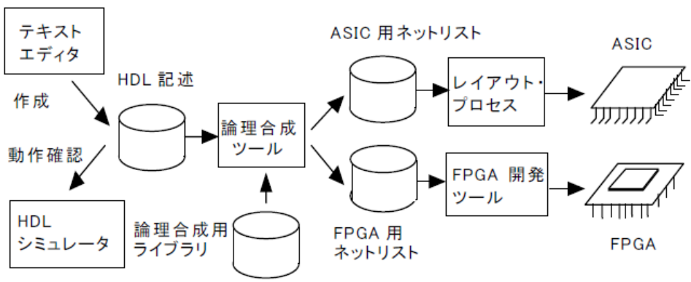
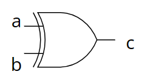
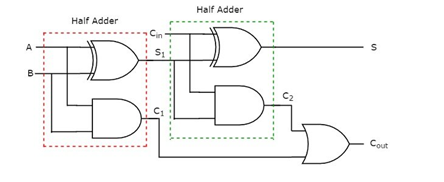
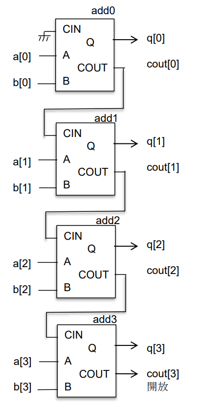
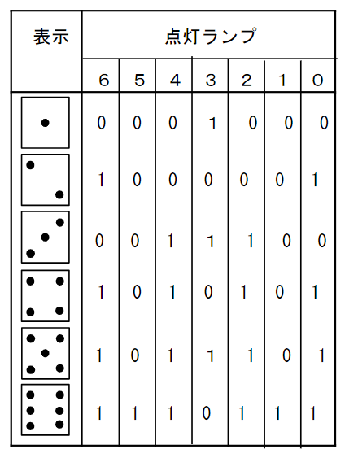
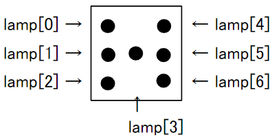

# 前期中間

## 1　HDLの種類

+ SFL
  + 論理合成ツール`PARTHENON`用HDL
+ UDL/I
  + 日本電子工業振興協会が標準化した純国産の標準HDL
+ VHDL
  + 1980 年代に米国国防総省の主導によって開発されたハードウェア記述言語
+ SystemC
  + システム設計を行う為の言語。C++のクラスライブラリとして提供
+ Verilog HDL
  + C言語の文法に似た電子回路シミュレータ`ASIC開発`に用いられる

## 2 Verilog で書かれたリストと回路図の対応

論理演算子

### ビット演算子

|演算子|記入例 | 説明|
|---|---| ---|
|~ | ~x  | xのビットを反転(NOT) |
|& | x & y | xとyのビットAND |
|\| | x \| y | xとyのビットOR |
|^ | x ^ y | xとyのビットXOR |

例題1

~~~v
module gexor(a,b,c);
input a,b;//入力:A,B
output c; //出力:C
assign c = a ^ b; //c は aとbのXOR
endmodule
~~~

 

例題2

~~~v
module test(a,b,c,d,x,y,z);
input a,b,c,d;
output x,y,z;

gand gandv(a,b,x); //x = aとbのand
gexor gexor(c,d,y); // y = cとdのxor

assign z = x & ~y; //z = xと反転yのand
endmodule
~~~

## 3 ４ビット加算回路

fulladder.v

~~~v
module fulladd(A, B, CIN, S, COUT);
input A,B,CIN;
output S,COUT;

assign S = A ^ B ^ CIN;
assign COUT  (A&B) | (B&CIN) | (CIN & bA);
endmodule
~~~

フルアダーを呼び出す方法

~~~v
// full adder
module adder_ripple( a, b, q );
input    [3:0]   a, b;
output  [3:0]   q;
wire  [3:0]   cout;
fulladd add0( a[0], b[0],   1'b0,  q[0], cout[0] ); //1'b0は解放
fulladd add1( a[1], b[1], cout[0], q[1], cout[1] );
fulladd add2( a[2], b[2], cout[1], q[2], cout[2] );
fulladd add3( a[3], b[3], cout[2], q[3], cout[3] );
endmodule
~~~

## 4 略称

|　略称 | 正式名称 |
| ----- | -------- |
| HDL | Hardware Deseription Language|
| RTL | Resistor Trasfer Level |
| ASIC| Application Specific Integrated Circuit|
| FPGA| Field Programmable Gate Array |
| IP  | Intellectual Property |

参考：(Wikiのリンク)
[HDL](https://ja.wikipedia.org/wiki/%E3%83%8F%E3%83%BC%E3%83%89%E3%82%A6%E3%82%A7%E3%82%A2%E8%A8%98%E8%BF%B0%E8%A8%80%E8%AA%9E)
[RTL](https://ja.wikipedia.org/wiki/%E3%83%AC%E3%82%B8%E3%82%B9%E3%82%BF%E8%BB%A2%E9%80%81%E3%83%AC%E3%83%99%E3%83%AB)
[ASIC](https://ja.wikipedia.org/wiki/ASIC)
[FPGA](https://ja.wikipedia.org/wiki/FPGA)
[IP](https://e-words.jp/w/%E7%9F%A5%E7%9A%84%E8%B2%A1%E7%94%A3.html)

## 5 モジュールの参照

名前によるポート接続は次のようにする
`．定義側ポート名（接続信号）`
接続:

~~~v
fulladd add0( a[0], b[0], 1’b0, q[0], cout[0] ); 
~~~

ポート接続:

~~~v
fulladd add0( .Q(q[0]), .COUT(cout[0]), .A(a[0]) , .B(b[0]), .CIN( 1’b0) ); 
~~~

## 6 バイナリカウンタの Verilog記述

テスト回路の記述中の空欄を埋める問題

~~~v
module counter( ck, res, q );
input     ck, res;  //入力信号
output   [3:0]  q; //出力信号
reg        [3:0] q; //regはレジスタ型の宣言．値を保持できる記憶素子
always @( posedge ck or posedge res ) begin
/*
順序回路はalways文で記述する．
続く＠()内はbegin以下の処理を行う条件で，
posedgeは信号の立ち上がりの意味．
cｋまたはresの立ち上がりで状態が遷移する．
*/
    if ( res== 1’b1 )
        q <= 4’h0; //qに4bitの0を代入
    else 
        q <= q + 4’h1;//インクリメント
    end
endmodule
~~~

## 7　電子さいころ

 

~~~v
module
saikoro(ck,reset,enable,lamp);
input  ck,reset,enable;
output [6:0] lamp;
reg    [2:0] cnt;
always@(posedge ck or posedge reset)
if ( reset==1'b1 )
    cnt <= 3'h1; //リセット時にcntは１にする
  else if (enable==1'b1 )
    if ( cnt==3'h6 )
      cnt <= 3'h1; //リセット
    else 
      cnt <= cnt + 3'h1;
end

function [6:0] dec; //decという名前の関数
input [2:0] din;
  case ( din )
    3'h1:    dec= 7'b0001000;
    3'h2:    dec= 7'b1000001;
    3'h3:    dec= 7'b0011100;
    3'h4:    dec= 7'b1010101;
    3'h5:    dec= 7'b1011101;
    3'h6:    dec= 7'b1110111;
    default: dec= 7'bxxxxxxx;
  endcase
endfunction

assign lamp = dec ( cnt );

endmodule
~~~
