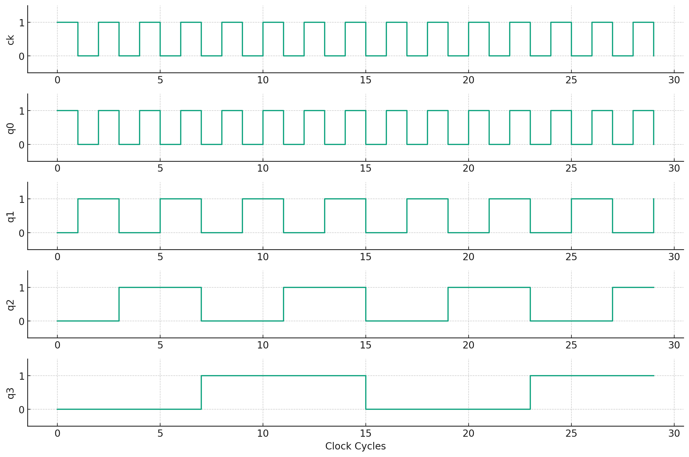
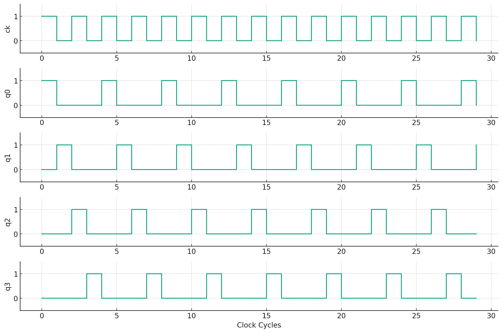
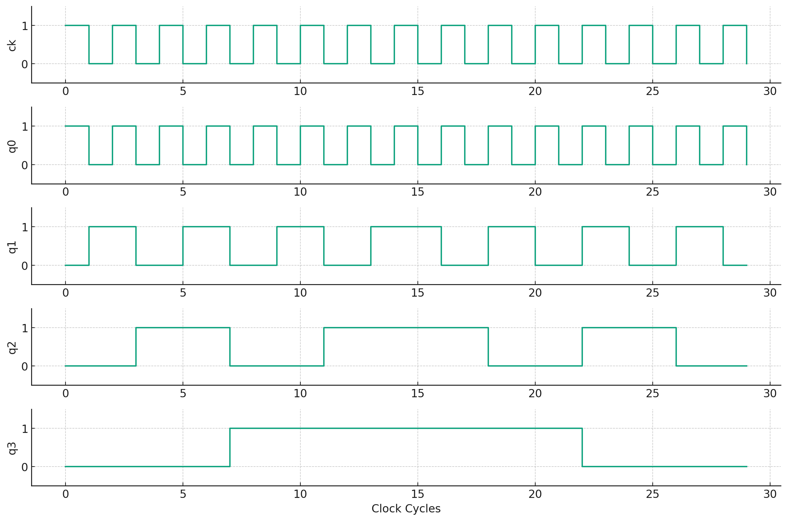
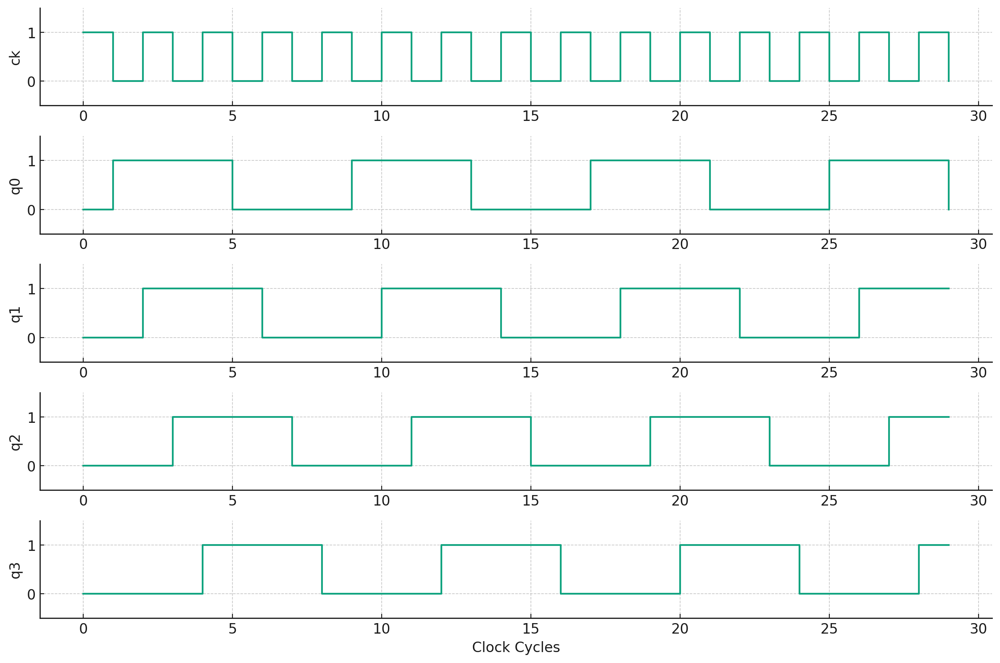
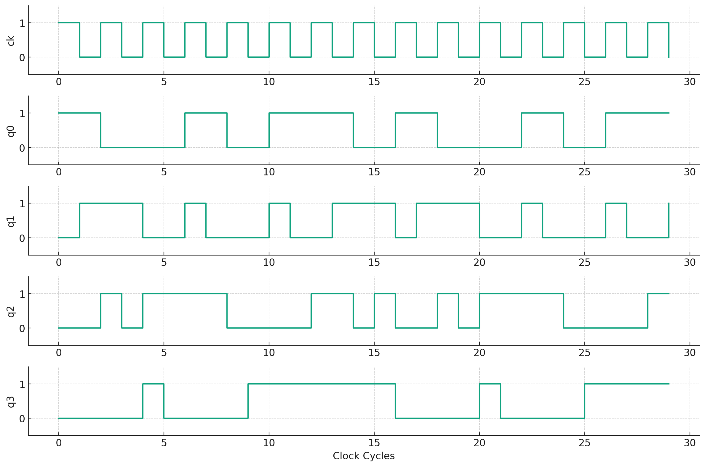

# カウンタ

## バイナリカウンタ



## リングカウンタ

4クロック1周期で出力1本だけが常に1となるカウンタ。
FF（フリップフロップ）を3個使用し、q[0]がq[2]～q[1]のNORで定義される。

q[0]がq[2]～q[1]のNOR

```v
assign q[0] = ~| ff;
```

リングカウンタの波形は、それぞれのフリップフロップが順番に高い状態（1）になり、その後低い状態（0）に戻る様子を示す。




## アップ・ダウンカウンタ

down信号が
`0`：カウント・アップ
`1`：カウント・ダウン
if文でdown信号によって分岐してｑをカウントダウン／アップしている

```v
if (res)
    q <= 4'h0;
else if (down)
    q <= q - 4'h1;
else
    q <= q + 4'h1;
```



アップ・ダウンカウンタの波形は、カウントアップ時には値が徐々に増加し、カウントダウン時には値が徐々に減少する。


## ジョンソンカウンタ

デューティ比が50％の波形が１クロックごとに伝搬し
た波形．クロックごとに

```v
q<<1，q[0]<= ~q[3]
```


最上位ビットを反転して最下位ビットに代入する

```verilog
module johnson_cnt (ck , res , q);
input ck , res;
output [3:0] q;
reg [3:0] q;

always @ (posedge ck or posedge res ) begin
    if (res)
        q <= 4'h0;
    else begin
        q    <= q << 1;
        q[0] <= -q[3];
    end
end 
endmodule
```




## グレイ・コード・カウンタ

グレイ・コード・カウンタは、隣接する値の間でビットが1つだけ変化するように設計されている。

```v
function [3:0] grey;
input [3:0] din;
    case(din)
        4'b0000 : grey = 4'b0001;
        4'b0001 : grey = 4'b0011;
        4'b0011 : grey = 4'b0010;
        4'b0010 : grey = 4'b0110;
        4'b0010 : grey = 4'b0111;
        // 以下、残りのケースを追加
    endcase
endfunction
```

グレイ・コード・カウンタの波形は、隣接するカウント値間で1ビットのみが変化する様子を示す。これは、通常のバイナリカウンタと比較して、誤差が少ない特徴がある

。

# シリアル・パラレル変換

si入力はシフト入力で1クロックごとに４ビットレジスタに
順次データを取り込む．ｅｎが１の時だけシフト動作する。

```verilog
q <= q << 1;
q[0] <= si;
```

連接演算子を使って1行で記述できる

```v
q <= { q, si};
```

右にシフトする場合

```v
q = {si , q[3:1]};
```

# RAM 

```verilog
assign READ  = (ceb == 0) & (ccb == 0);
assign WRITE = (web == 0) & (ceb == 0);
assign #RDELAY data = (READ) ? mem[addr] : 8'hzz;
```

