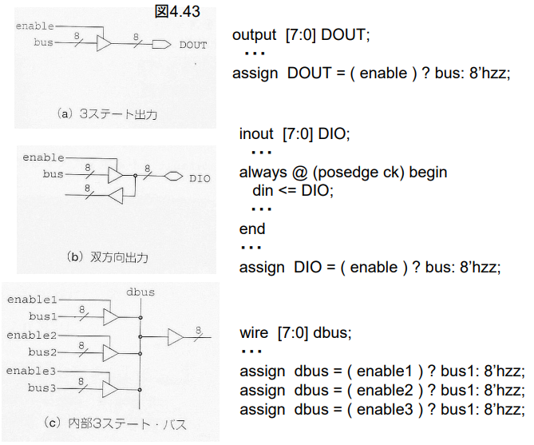

# ３ステート信号

このVerilogコードは、トライステート（3状態）バッファのモジュールを定義しています。

- `module tri_out(enable, bus, DOUT);`: `tri_out`モジュールを定義しています。
  - `input enable;`: 1ビットの入力信号 `enable` を宣言しています。これは出力信号 `DOUT` の有効/無効を制御します。
  - `input [7:0] bus;`: 8ビットの入力信号 `bus` を宣言しています。この信号はトライステート（3状態）バッファの入力データを表します。
  - `output [7:0] DOUT;`: 8ビットの出力信号 `DOUT` を宣言しています。これはトライステート（3状態）バッファの出力データを表します。

- `assign DOUT = (enable) ? bus : 8'hzz;`: `assign`文を使用して、出力信号 `DOUT` を計算しています。
  - この式は条件演算子（三項演算子）を使用しています。`(enable) ? bus : 8'hzz` という式は次のように解釈されます：
    - もし `enable` が1（真）の場合、`DOUT` に `bus` の値を代入します。
    - もし `enable` が0（偽）の場合、`DOUT` にトライステート（3状態）の不明な値 `8'hzz` を代入します。

トライステート（3状態）バッファは、有効信号 `enable` によって制御されるバッファです。`enable` が1（真）の場合、入力信号 `bus` の値が出力信号 `DOUT` に伝達されます。一方、`enable` が0（偽）の場合、出力信号 `DOUT` は高インピーダンス（高Z）状態になります。これにより、他の回路によって出力信号を制御できるようになります。トライステートバッファは、多重化バス（マルチプレクサ）などの場面で特に有用です。

## シミュレーション

~~~v
         0 enable=0 bus=00 DOUT=zz 
    100000 enable=0 bus=ff DOUT=zz
    200000 enable=1 bus=00 DOUT=00
    300000 enable=1 bus=ff DOUT=ff
~~~

それぞれのシミュレーションステップごとの出力を説明します：

- ステップ0: `enable` が0のため、`DOUT` は高インピーダンス状態（zz）になります。
- ステップ100000: まだ `enable` は0なので、`DOUT` は高インピーダンス状態（zz）です。入力信号 `bus` の値は0xff（2進数で11111111）ですが、この値は出力には影響を与えません。
- ステップ200000: `enable` が1になるため、`DOUT` は入力信号 `bus` の値と同じ値になります。入力信号 `bus` の値が0x00（2進数で00000000）なので、`DOUT` も0x00になります。
- ステップ300000: `enable` がまだ1のままで、入力信号 `bus` の値が0xff（2進数で11111111）なので、`DOUT` も0xffになります。

したがって、出力結果は正しい動作を示しています。最初の2つのステップでは、`enable` が0なので、`DOUT` は高インピーダンス状態（zz）となり、入力信号 `bus` の値には影響を与えません。ステップ200000と300000では、`enable` が1なので、`DOUT` は入力信号 `bus` の値に等しくなります。